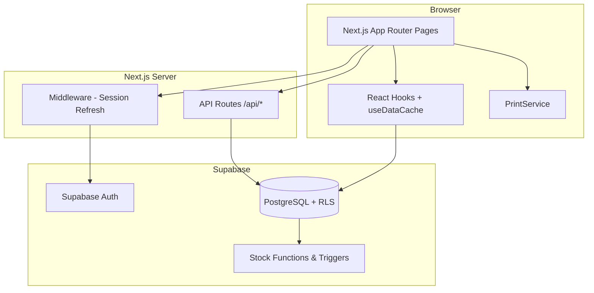

# SVJ Outdoor — Employer Demo Script

A narrative walkthrough for presenting the SVJ Outdoor Point of Sale and inventory management system to a potential employer. Use this as a spoken script, a rehearsal guide, or a leave-behind outline.

**Suggested demo length:** 18–25 minutes (core flow) · 35–45 minutes (with technical deep-dive)

**App language:** Indonesian UI · This script is in English for interview delivery

---

## What You Want Them to Remember

By the end of the demo, the employer should understand that you built:

1. A **production-minded full-stack web app** — not a toy CRUD project
2. A **real business workflow** — POS, inventory, purchases, expenses, reporting
3. **Role-based access** with distinct admin vs. cashier experiences
4. **Thoughtful engineering** — caching, lazy loading, RLS, heartbeat presence, receipt printing
5. **End-to-end ownership** — database migrations through UI polish

---

## Pre-Demo Checklist

### Environment

- [ ] App running locally (`npm run dev`) or deployed (Vercel recommended)
- [ ] Supabase project healthy; migrations applied (31 migration files)
- [ ] `.env.local` configured with valid Supabase keys
- [ ] Browser at 100% zoom, dark/light mode consistent, notifications off
- [ ] Second browser window or incognito profile ready for cashier role (optional but impressive)

### Demo Data

Prepare realistic outdoor retail data so the demo feels authentic:

| Entity | Suggested examples |
|--------|-------------------|
| Categories | Tenda 4P, Sleeping Bag, Carrier 60L, Headlamp, Trekking Pole |
| Members | 2–3 named customers with member codes |
| Suppliers | 1–2 vendor names |
| Purchases | At least 1 inbound stock record |
| Expenses | Rent, utilities, or packaging costs |
| Sales history | 5–10 past transactions across cash and debit |

### Accounts

| Role | Level | Landing page after login |
|------|-------|--------------------------|
| Administrator | 1 | `/dashboard` |
| Cashier | 2 | `/pos` |

- [ ] Admin account tested
- [ ] Cashier account tested (create via **Pengguna → Tambah Pengguna** if needed)
- [ ] Passwords written down; forgot-password flow tested once

### Browser Setup

- [ ] Pop-ups allowed (for receipt printing)
- [ ] DevTools closed unless doing a technical demo
- [ ] Bookmark tabs: Login → Dashboard → POS → Reports

### Fallback Plan

If live demo fails:

1. Switch to a deployed staging URL
2. Show screenshots or a short screen recording
3. Walk through code: `src/app/(dashboard)/pos/page.tsx`, `src/app/api/sales/route.ts`, `supabase/migrations/`

---

## Opening (0:00 – 1:30)

> **You say:**
>
> "Thanks for taking the time today. I built **SVJ Outdoor** — a point-of-sale and inventory system for an outdoor retail business. The goal wasn't just to build a checkout screen; it was to solve the full operational loop: stock comes in, items get sold at the register, cashiers are monitored, and owners get reporting they can act on.
>
> The stack is **Next.js 16**, **React 19**, **TypeScript**, and **Supabase** — PostgreSQL with auth and row-level security. It's responsive, role-aware, and designed for a small retail team with an admin and one or more cashiers.
>
> I'll walk you through a typical day: admin overview, a live sale at the register, and how the data flows into reports. Feel free to interrupt with questions."

**[Screen: Login page at `/login`]**

> "The login page sets the tone — branded, responsive, and secure via Supabase Auth. Admins land on the dashboard; cashiers go straight to the POS so they aren't distracted by back-office screens."

---

## Part 1 — Authentication & Role Routing (1:30 – 3:00)

**[Action: Log in as Administrator]**

> **You say:**
>
> "Authentication uses Supabase with SSR session handling through Next.js middleware. Every protected route passes through `updateSession` before rendering. Role is stored in a `users` table — level 1 for admin, level 2 for cashier — and that drives both navigation and database access via RLS policies."

**[Point out after login]**

- Admin sees full sidebar: Dashboard, Kategori, Laporan, Member, Supplier, Penjualan, Kasir, Pembelian, Pengeluaran, Pengguna, Pengaturan, Profil
- Cashier sees only: Kasir, Laporan (personal dashboard), Profil

> "This isn't just UI hiding — cashiers have RLS policies that limit what they can read and write. For example, cashiers can view categories for POS but can't manage users or settings."

**Technical note (if asked):** Post-login redirect is centralized in `getPostLoginPath()` — admins → `/dashboard`, cashiers → `/pos`.

---

## Part 2 — Admin Dashboard (3:00 – 7:00)

**[Screen: `/dashboard` as Admin]**

> **You say:**
>
> "The admin dashboard is the command center. At a glance I see total categories, total sales, and — critically — **cashier performance** with live presence indicators."

**[Scroll to Performa Kasir section]**

> "Each cashier card shows transaction count, total revenue, and a breakdown of cash vs. debit payments. The Online / Active / Offline badge comes from a heartbeat system: cashiers ping every 30 seconds while logged in, and the admin dashboard polls every 20 seconds. That gives managers visibility without building a separate monitoring tool."

**[Toggle time filter: Today → Weekly → Monthly]**

> "Filters let the owner compare performance across time periods — useful for shift planning and commission discussions."

**[Scroll to Penjualan per Kategori chart]**

> "Sales by category helps answer 'what's actually moving?' — tents vs. sleeping bags vs. accessories. This feeds merchandising decisions."

**[Scroll to Penjualan Terbaru table]**

> "Recent sales are searchable and filterable by cashier, date, amount range, and category. Clicking a row opens a slide-out drawer with full line-item detail — no page reload."

**[Click a sale → open drawer]**

> "Every transaction stores line items, discounts, payment method, member association, and the cashier who processed it. Admins can reprint receipts directly from here."

**Engineering talking points:**

- Client-side caching via `useDataCache` (stats TTL: 2 min, recent sales: 30 sec)
- `React.memo`, `useMemo`, lazy-loaded `SaleDetailsDrawer`
- Parallel data fetching with `Promise.all`

---

## Part 3 — Inventory: Categories (7:00 – 9:00)

**[Navigate: Sidebar → Kategori → `/categories`]**

> **You say:**
>
> "SVJ Outdoor uses a **category-based inventory model** — each sellable item is a category with a name, sale price, stock count, and unique category code. This fits rental/retail outdoor gear where SKUs are grouped logically rather than individual serial numbers."

**[Show category list]**

> "Stock decrements automatically when a sale completes — enforced at the database layer through stock functions in PostgreSQL migrations, not just in the frontend."

**[Optional: Kategori → Tambah Kategori or Edit]**

> "Admins can add categories with initial stock, edit pricing, and delete with safeguards — if a category has transaction history, the system warns before cascading deletes."

**[Mention print capability if visible]**

> "Categories support barcode label printing via a dedicated print service — useful for shelf labeling in the store."

---

## Part 4 — The POS Experience (9:00 – 14:00) ⭐ Core Demo

> **You say:**
>
> "Now the heart of the app — the point of sale. I'll process a realistic transaction so you can see speed, validation, and what happens to inventory."

**[Navigate: Kasir → `/pos`]**

### 4a. Product Selection

> "The left panel shows all categories with search. The cashier taps items to add them to the cart — each line is independent, which supports per-item discounts and price overrides."

**[Action: Search for a category, add 2–3 items]**

> "Search filters in real time. Stock levels are visible so cashiers know if something is unavailable before checkout."

### 4b. Cart Management

**[Right panel — cart]**

> "In the cart I can adjust quantity, apply **percentage or fixed-amount discounts** per line, override price for negotiated deals, and remove items. The subtotal, total discount, and net total update live."

**[Apply a discount on one item]**

> "Discount logic is centralized in a shared utility — `clampDiscountValue` and `getNetSaleAmount` — so POS, dashboard, and reports all calculate totals consistently."

### 4c. Member & Payment

> "Optionally attach a registered member — useful for loyalty tracking. Then select payment method: **cash** or **debit**."

**[Select a member from dropdown]**

**[Choose Tunai (cash), enter amount received > total]**

> "For cash, the system validates sufficient payment and calculates change automatically. For debit, payment must match the exact total — mirroring real card terminal behavior."

### 4d. Complete the Sale

**[Click Proses Penjualan]**

> "The sale POSTs to `/api/sales`, which creates the header record, line items, updates stock, and returns the sale ID. On success, we redirect to a confirmation page."

**[Screen: `/pos/complete?id=...`]**

> "The completion screen shows a full receipt preview: company info, line items, discounts, payment, change, cashier name, and member details."

### 4e. Receipt Printing

**[Click Cetak Struk — show 58mm and 80mm options if available]**

> "Receipt printing uses a dedicated `PrintService` with thermal printer formats — 58mm and 80mm — plus PDF export. Settings like paper width, font size, and footer text are configurable by the admin. Receipts can include QR codes and barcodes via jsPDF, QRCode, and JsBarcode."

**[Click Transaksi Baru or Kembali ke POS]**

> "The cashier is ready for the next customer. Stock has already decremented in the database."

**If you have a second browser:** Log in as cashier in incognito, keep admin dashboard open, and point out the cashier's Online badge updating.

---

## Part 5 — Back-Office Operations (14:00 – 17:00)

### Members

**[Navigate: Member → `/members`]**

> "Members are the customer database — name, contact info, unique member code. Admins can print **member cards** for in-store identification, and cashiers attach members at checkout."

### Suppliers & Purchases

**[Navigate: Supplier → `/suppliers`, then Pembelian → `/purchases`]**

> "When stock arrives from vendors, admins record purchases linked to suppliers. This is the inbound side of inventory — it complements the outbound stock reduction from sales and gives accurate stock levels for reporting."

**[Optional: Pembelian → New Purchase]**

> "A new purchase adds quantity back to category stock — closing the inventory loop."

### Expenses

**[Navigate: Pengeluaran → `/expenses`]**

> "Operating expenses — rent, utilities, supplies — feed into profit-and-loss reporting. Sales alone don't tell the full financial story."

### Sales History

**[Navigate: Penjualan → `/sales`]**

> "The full sales ledger with search, filters, detail views, and admin-only delete with confirmation. This is the audit trail."

---

## Part 6 — Reporting (17:00 – 20:00)

**[Navigate: Laporan → `/reports`]**

> **You say:**
>
> "The reports hub organizes analytics into four areas: sales, financial, inventory, and customer. I'll show the ones that are fully implemented."

### Recommended reports to demo

| Report | Route | What to highlight |
|--------|-------|-------------------|
| Ringkasan Penjualan | `/reports/sales-summary` | Total revenue, transactions, overview metrics |
| Penjualan per Kategori | `/reports/sales-by-category` | Category performance breakdown |
| Laporan Penjualan Harian | `/reports/daily-sales` | Daily trend analysis |
| Produk Terlaris | `/reports/top-selling` | Best-performing items |
| Laba Rugi | `/reports/profit-loss` | Revenue vs. COGS vs. expenses, margins, daily P&L chart |
| Tingkat Stok | `/reports/stock-levels` | Current inventory status |
| Peringatan Stok Rendah | `/reports/low-stock` | Items needing reorder |

**[Open Laba Rugi → `/reports/profit-loss`]**

> "Profit and loss pulls from sales, purchase costs, and expenses over a selectable date range. It shows gross profit margin, operating profit, expense breakdown, and a daily trend — the kind of report a business owner actually opens on Monday morning."

**[Adjust date range, show charts]**

> "Charts use Recharts. Data comes from dedicated API routes under `/api/reports/*` with server-side aggregation — the browser isn't crunching thousands of rows."

**Note:** Some cards on the reports hub (e.g., Arus Kas, Analisis Pelanggan) are planned navigation targets; stick to the seven reports above during a live demo.

---

## Part 7 — Admin Configuration (20:00 – 22:00)

### Settings

**[Navigate: Pengaturan → `/settings`]**

> "Admins configure company name, address, phone, and receipt formatting — paper width, font size, paper type, custom footer. These settings flow into every printed receipt."

### User Management

**[Navigate: Pengguna → `/users`]**

> "Admins create cashier accounts, edit profiles, and manage access. Each cashier gets level 2 — they see a focused UI and are subject to tighter RLS policies."

### Profile

**[Navigate: Profil → `/profile`]**

> "Any user can update their name, email, and password. Password changes go through a dedicated API route with validation."

---

## Part 8 — Cashier Perspective (Optional, 22:00 – 24:00)

**[Switch to cashier account or describe from admin session]**

> **You say:**
>
> "Let me quickly show the cashier experience — it's intentionally minimal."

**[Log in as Cashier → lands on `/pos`]**

> "Cashiers skip the admin dashboard entirely. Their sidebar has three items: Kasir, Laporan, Profil."

**[Navigate: Laporan → `/dashboard` as cashier]**

> "The cashier dashboard shows *their* metrics: today's revenue with cash/debit split, today's transaction count, and their personal sales history — not company-wide data."

> "This role separation reduces training time and prevents accidental changes to inventory or settings during a busy shift."

---

## Technical Deep-Dive (Optional, 24:00 – 35:00)

Use this section if the employer is engineering-focused or asks "how did you build this?"

### Architecture



### Stack Summary

| Layer | Technology |
|-------|-----------|
| Framework | Next.js 16 (App Router, Turbopack) |
| UI | React 19, TypeScript, Tailwind CSS 4 |
| Components | Headless UI, Heroicons, Lucide |
| Backend | Supabase (PostgreSQL, Auth, RLS) |
| Charts | Recharts |
| Printing | jsPDF, html2canvas, react-to-print, QRCode, JsBarcode |
| Deployment | Vercel (recommended) |

### Database Design

31 SQL migrations covering:

- Users with role levels and heartbeat timestamps
- Categories (inventory + pricing) — evolved from an earlier products table
- Sales header + line items with discount types (percentage/amount)
- Purchases, expenses, members, suppliers, settings
- PostgreSQL functions for stock increment/decrement
- RLS policies per role (including cashier read access to categories)

### API Surface

| Route | Purpose |
|-------|---------|
| `POST /api/sales` | Create sale, line items, update stock |
| `GET /api/sales/[id]` | Sale detail for receipt/confirmation |
| `GET /api/reports/*` | Aggregated reporting data |
| `GET/POST /api/categories` | Category CRUD with caching |
| `POST /api/profile/password` | Secure password change |
| `POST /api/auth/forgot-password` | Password reset flow |

### Performance Decisions

- `useDataCache` hook with TTL-based client caching
- `React.memo` on Sidebar, Header, StatsCard, RecentSalesTable
- Dynamic import of SaleDetailsDrawer
- `optimizePackageImports` for icon/chart libraries
- Parallel fetching with `Promise.all` on dashboard load
- Route prefetching on sidebar hover

### Security Decisions

- Supabase Auth with SSR cookie sessions
- Middleware session refresh on every request
- Row Level Security on all business tables
- Role-based navigation (UI) + RLS (data layer)
- Service role key only on server-side routes that need it

---

## Closing (35:00 – 37:00)

> **You say:**
>
> "To summarize: SVJ Outdoor is a full operational system for a retail business — not just a POS screen. It handles the complete loop from stock inbound to checkout to financial reporting, with role-based access, real-time cashier monitoring, and production-minded performance optimizations.
>
> I owned this from database schema design through UI polish, including 31 migrations, API routes, print services, and responsive layouts. It's deployable today on Vercel with Supabase as the backend.
>
> I'm happy to go deeper on any area — the sales API, RLS policies, the heartbeat system, or how I'd extend this with payment gateway integration, multi-store support, or offline mode.
>
> What would be most useful to explore next?"

---

## Anticipated Questions & Answers

### "Why categories instead of individual products?"

> "The business model fits outdoor retail/rental where items are grouped by type and price tier. Categories simplify POS speed — cashiers tap 'Tenda 4P' rather than scanning serial numbers. The schema evolved: an early products table was removed in favor of this model, which you can see in migrations 019 and 021."

### "How do you handle concurrent sales reducing stock below zero?"

> "Stock updates run through PostgreSQL functions in migrations 012 and 018. The API validates stock before completing a sale. I'd extend this with row-level locking or optimistic concurrency if scaling to high-volume multi-register scenarios."

### "Why Supabase instead of a custom backend?"

> "Speed to production: auth, PostgreSQL, RLS, and real-time capabilities out of the box. For a retail SMB, managed infrastructure reduces ops burden. The Next.js API routes handle business logic that shouldn't run client-side."

### "How would you scale this?"

> "Short term: Redis caching for report queries, read replicas for analytics, edge deployment on Vercel. Medium term: event-driven stock updates, webhook integrations for accounting (Xero/QuickBooks), barcode scanner hardware API. The current architecture separates API routes and database functions, so scaling layers are additive."

### "What would you improve next?"

> "Top three: (1) offline-capable POS with sync for unreliable connections, (2) automated low-stock purchase orders, (3) E2E tests for the sales flow with Playwright. Some report hub cards are navigation placeholders — I'd finish cash flow and customer analysis reports next."

### "How did you ensure data consistency?"

> "Shared discount utilities used across POS, dashboard, and reports. Server-side sale creation in one API transaction. Database functions for stock mutations. There's also a DATA_CONSISTENCY_FIX.md documenting specific issues resolved."

---

## Demo Timing Cheat Sheet

| Segment | Duration | Route |
|---------|----------|-------|
| Opening + login | 1:30 | `/login` |
| Admin dashboard | 4:00 | `/dashboard` |
| Categories | 2:00 | `/categories` |
| **Live POS sale** | 5:00 | `/pos` → `/pos/complete` |
| Back-office tour | 3:00 | `/members`, `/purchases`, `/expenses` |
| Reports | 3:00 | `/reports/profit-loss` |
| Settings + users | 2:00 | `/settings`, `/users` |
| Cashier perspective | 2:00 | `/pos` (cashier account) |
| Closing + Q&A | 5:00+ | — |

---

## Appendix: Route Map

```
/                     → Redirect
/login                → Authentication
/signup               → Registration
/dashboard            → Admin overview / Cashier personal stats
/categories           → Inventory management (admin)
/members              → Customer database (admin)
/suppliers            → Vendor management (admin)
/purchases            → Inbound stock (admin)
/expenses             → Operating costs (admin)
/sales                → Sales ledger (admin)
/pos                  → Point of sale (admin + cashier)
/pos/complete         → Transaction confirmation + print
/reports              → Reports hub (admin)
/reports/*            → Individual reports
/users                → User management (admin)
/settings             → System configuration (admin)
/profile              → User profile (all roles)
```

---

## Appendix: Key Files to Reference in Code Review

| Area | File |
|------|------|
| POS checkout | `src/app/(dashboard)/pos/page.tsx` |
| Sale completion + print | `src/app/(dashboard)/pos/complete/page.tsx` |
| Sales API | `src/app/api/sales/route.ts` |
| Admin dashboard | `src/app/(dashboard)/dashboard/page.tsx` |
| Role-based nav | `src/components/layout/Sidebar.tsx` |
| Auth redirect | `src/lib/auth-redirect.ts` |
| Session middleware | `src/lib/supabase/middleware.ts` |
| Cashier heartbeat | `src/hooks/useCashierHeartbeat.ts` |
| Presence logic | `src/lib/cashier-presence.ts` |
| Print service | `src/lib/print-service.ts` |
| Discount utilities | `src/lib/discount.ts` |
| Data caching | `src/hooks/useDataCache.ts` |
| DB migrations | `supabase/migrations/*.sql` |

---

*Good luck with the demo. Rehearse the POS flow at least twice — it's the moment that sells the project.*
